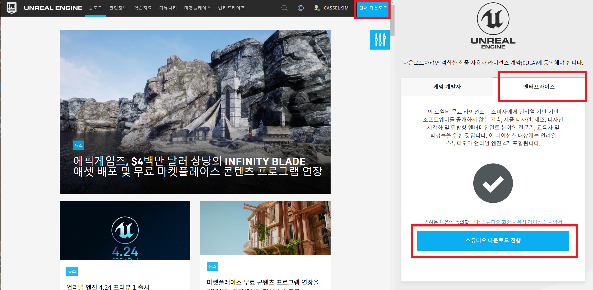
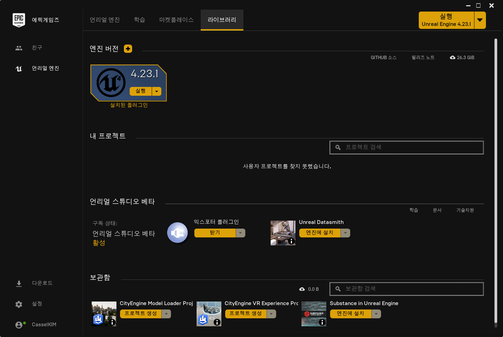
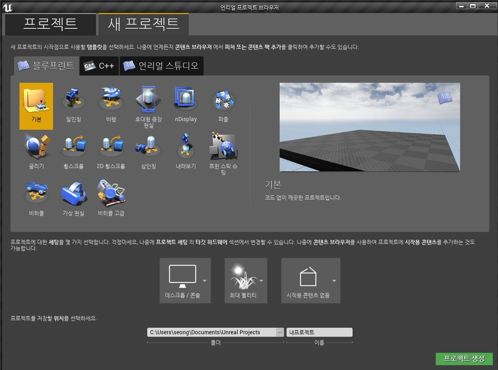
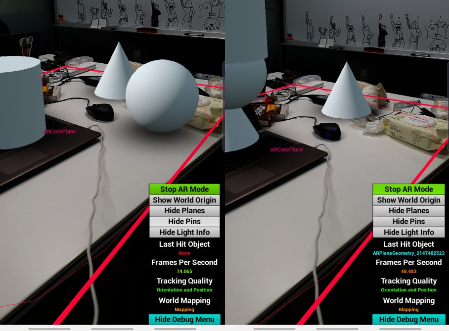

# Unreal Engine

언리얼 엔진을 시작해봅시다

공식 홈페이지 : [https://www.unrealengine.com/ko/feed](https://www.unrealengine.com/ko/feed)  

------

배포용 게임을 제작하실거면 게임개발자를, 다른 분야의 개발을 원하시면 엔터프라이즈를 선택해주세요

　  

언리얼 스튜디오를 다운받고 언리얼 엔진을 받아주세요.

　  

[언리얼 엔진 공식 튜토리얼 - 차근차근 알아보는 언리얼 엔진]( https://www.youtube.com/watch?v=sYqbaAhdTzk&list=PLkHDai4yit5Xm9912XjC6c4TCuI3IX-Mh )

[쌩초보를 위한 언리얼엔진 강좌 Level-1]( https://www.youtube.com/watch?v=7JtsGIjK0hM&list=PLtmQsn29mAv-PqbRIUKiRrDYSuXtOHb6S )  

　  

## 용어 정리

* 프로젝트 : 게임을 이루는 콘텐츠와 코드 모두가 들어있는 독립적인 유닛

* 오브젝트 : 언리얼 엔진의 기본 구성 요소

* 클래스 : 게임 제작에 사용되는 특정 액터 or 오브젝트의 작동방식, 프로퍼티

* 액터 : 레벨에 배치할 수 있는 오브젝트. 이동,회전,스케일 등의 3D 트랜스폼을 할 수 있으며 c++ 혹은 블루프린트를 통해 생성(스폰) 및 소멸이 가능

* 컴포넌트 : 액터에 추가시킬 수 있는 함수성 조각

* 폰 : 액터의 서브클래스, 게임내 아바타 or 페르소나 (AI의 제어? Possess (빙의) : Unpossess)

* **플레이어 컨트롤러** : 폰과 그것을 제어하는 사람 사이의 인터페이스 == 플레이어의 의지

* 브러시 : 레벨 지오메트리(BSP) 및 게임플레이 볼륨을 정의하기 위해 레벨에 배치하는 3D 볼륨

* 레벨 : 게임플레이에 사용자 정의된 영역. == 맵

* 월드 : 레벨 스트리밍 및 동적인 액터 스폰을 처리

* 게임 모드 : 플레이중인 게임의규칙 설정을 담당(레벨당 설정 가능)

* 게임 스테이트 : 게임의 상태

* 플레이어 스테이트 : 게임내 참여자의 상태

　  
 

## 언리얼 AR

### 언리얼 엔진과 휴대폰의 연결

언리얼 엔진은 자체적으로 휴대폰과의 연결을 지원하지 않는다

다만, 휴대폰 OS 회사들이 자체적으로 만들어 놓은 AR API들과 연동된 Plug-in을 지원할 뿐이다.

다시말해, 애플이 만든 ARkit라든지 구글이 만든 ARCore 등을 사용해야 된다는 것이다.

*(본 설명은 ARCore에 최적화 되어있습니다)*

　  

**준비물**

- [개발 가능한 컴퓨터 환경](https://docs.unrealengine.com/ko/GettingStarted/RecommendedSpecifications/index.html)

- 언리얼엔진 4.19 이상

- [Codeworks for Android 설치](https://developer.nvidia.com/codeworks-android)

  *(근데 NDK버전은* **[[Android NDK, 수정 14b(2017년 3월), Windows 64bit\]](https://developer.android.com/ndk/downloads/older_releases.html)** *이걸로 받아야한다)*

- [AR Core가 지원되는 휴대폰](https://developers.google.com/ar/discover/supported-devices)

- [AR Core가 지원되는 Android 버전](https://kwon8999.tistory.com/entry/안드로이드-SDK-번호와-버전-정리)

  *( Android API Level 24 이상 == Android Version 7.0 (너겟) 이상)*

- 휴대폰과의 연결

  - [휴대폰 드라이버](https://developer.android.com/studio/run/oem-usb#Drivers)
  - [개발자 모드 활성화](https://docs.unrealengine.com/ko/Platforms/Mobile/Android/SettingAndroidDeviceDevelopment/index.html)

　  

위의 준비물을 다 챙겼으면 실제로 실행해보자. 언리얼 엔진에서 제공하는 기본 AR 템플릿이다.

[언리얼엔진 - 증강 현실 퀵스타트]( https://docs.unrealengine.com/ko/Platforms/AR/HandheldAR/ARQuickStart/index.html )  

　  

**결과물**

